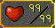

# Max Skill Trim

This plugin adds a visual border around skills that you have achieved 99 in.

## Adding custom trims!

> :information_source: Use the provided `template.psd` or `template.afdesign`. to make sure dimensions are correct!

1. Open the plugin panel in Runelite and press `Open Folder`.
2. Drop your PNG file in.
3. In the plugin panel press the `Refresh` button to locate your new file from the dropdown.

## Screenshots

Full trim example

