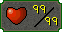
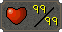
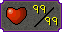
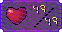
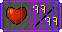

# Custom Trims

The purpose of this branch is to allow people to submit / download custom trims. 

## Installing custom trims.

1. Find the trim you'd like from below and click the link or navigate to the trim manually by going to the custom-trims folder.
2. Open up the Max Skill Trim plugin panel in Runelite and press 'Open Folder' or navigate to `%USERPROFILE%/.runelite/max-skill-trims`.
3. Copy the trim to this folder.
4. In the Max Skill Trim panel press `Refresh` or restart Runelite.
5. You should now be able to select the newly installed trim.

## Creating new custom trim.

> :information_source: The templates folder contains very simple `.afdesign` and `.psd` templates so that sizing and dimensions can be ensured.

1. Create a trim using your preferred software.
1. Inside custom-trims give your trim a name and create a folder for it.
1. Export two images, one PNG for use in the client and one image for use in the README as an example.
1. Update the screenshots table below with your new icon and link to client useable trim. I personally use a short UUID generator for folder names, but feel free to use anything.
1. Create a PR to merge your icon in.

| Default Trims |  |
| ---: | --- |
|  |  | 

| Babywise Trims |  |  |  |  |  |  |
| ---: | :---: | :---: | :---: | :---: | :---: | :---: |
|  |  |  |  |  |  |  |  |
|  |  |  |  |  |
|  |  |  |  |  |  |
|  |  |  |
|  |  |
